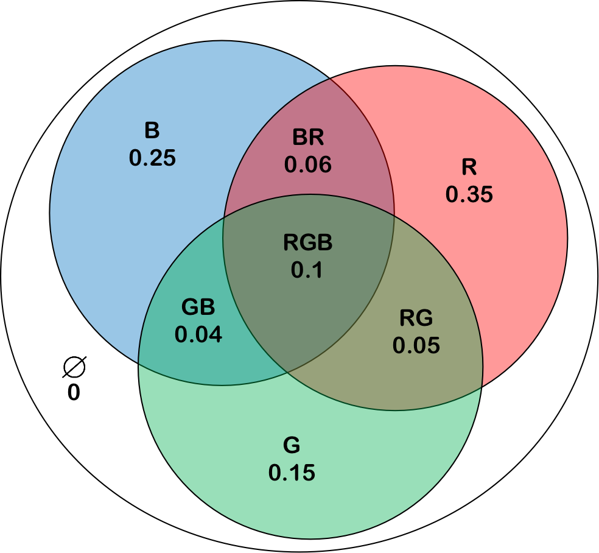

# Dempster-Shafer Evidence Theory for Multimodality Classification

Author: <a href="https://yusijin02.github.io/">Sijin Yu</a>

*本文的举例、图片完全参考了 github 用户 <a href="https://github.com/cf020031308">Roy</a> 的博客 [<a href="https://cf020031308.github.io/wiki/dempster-shafer-theory-and-subjective-logic/">1</a>]. 本文在其基础上增加了数学的形式化表达, 详细了其例, 重画了图片.

[TOC]

## 1. Discernment Frame (识别框架)

**识别框架 (Discernment Frame)** 指所有可能的基本事件的集合. 例如:
$$
\Theta =\{\theta_1,\theta_2,\cdots,\theta_n\}
$$
就是一个由 $n$ 个两两互斥的基本事件构成的 discernment frame.

> **举例参考**:
>
> 参考 [<a href="https://cf020031308.github.io/wiki/dempster-shafer-theory-and-subjective-logic/">1</a>] 中的举例, 考虑一个灯, 可能发出 R, G, B 三种颜色的光. 因此这里 $n =3$, 这三种基本事件为 $\theta_1=R$ 表示发红色光, $\theta_2=G$ 表示发绿色的光, $\theta_3=B$ 表示发绿色的光. 则 discernment frame 为 $\Theta =\{\theta_1, \theta_2, \theta_3\} =\{R, G, B\}$.

## 2. Mass Function (质量函数)

给定 discernment frame $\Theta$, **质量函数 (Mass Function)** 是定义在幂集 $2^\Theta$ 上的函数 $\mathcal M$, 定义为:
$$
\mathcal M:2^\Theta\to [0,1]
$$
Mass function $\mathcal M$ 满足两个性质,

- 空集的 mass 为 0, 即
  $$
  \mathcal M(\varnothing)=0
  $$

- 所有可能的组合的 mass 之和为 1, 即
  $$
  \sum_{A\sube \Theta}\mathcal M(A)=1
  $$

> **举例参考**:
>
> Mass 的意义是各种假设的可能性. 在上面的举例中, 假设一个观察者观测后, 对每个假设分配了 mass 值, 如下:
>
> | 假设          | 含义         | Mass |
> | ------------- | ------------ | ---- |
> | $\varnothing$ | 不发光       | 0    |
> | $\{R\}$       | 发红光       | 0.35 |
> | $\{G\}$       | 发绿光       | 0.15 |
> | $\{B\}$       | 发蓝光       | 0.25 |
> | $\{R, G\}$    | 发红光或绿光 | 0.05 |
> | $\{G, B\}$    | 发绿光或蓝光 | 0.04 |
> | $\{B, R\}$    | 发蓝光或红光 | 0.06 |
> | $\{R, G, B\}$ | 发某一种光   | 0.1  |
>
> 画成 Venn Diagram 如下:
>
> 

## 3. Belief Function (信度函数)

集合 $A\sube \Theta$ 的**信度 (Belief)** 定义为: $A$ 所有子集的 mass 之和. 即:
$$
Bel(A)=\sum_{B\sube A}\mathcal M(B)
$$

> **举例参考**:
>
> 在上面的例子中, 各种组合的 belief 为:
>
> - $Bel(R)=\mathcal M(R) = 0.35$
> - $Bel(G)=\mathcal M(G) = 0.15$
> - $Bel(B)=\mathcal M(B)=0.25$
> - $Bel(RG)=\mathcal M(RG) + \mathcal M(R) + \mathcal M(G)=0.55$
> - $Bel(GB)=\mathcal M(GB) + \mathcal M(G) + \mathcal M(B)=0.44$
> - $Bel(BR)=\mathcal M(BR) + \mathcal M(B) + \mathcal M(R)=0.66$
> - $Bel(RGB)=\mathcal M(RGB)+\mathcal M(RG)+\mathcal M(GB)+\mathcal M(BR) + \mathcal M(R) +\mathcal M(G)+ \mathcal M(B)=1$
>
> 注意, 这里的数学符号不太严谨, 因为函数 $Bel(\cdot),\mathcal M(\cdot)$ 的输入都是集合. 这里的 $Bel(R)$ 实际上应该为 $Bel (\{R\})$, $\mathcal M(RGB)$ 实际上应该为 $\mathcal M(\{R, G,B\})$, 其余同理. 这里采用这样的写法是为了简洁.

## 4. Plausibility Function (似然函数)

集合 $A\sube \Theta$ 的**似然 (Plausibility)** 定义为: 与 $A$ 相交的所有集合的 mass 之和. 即:
$$
Pls(A)=\sum_{B\cap A\neq\varnothing}\mathcal M(B)
$$

> **举例参考**:
>
> 在上面的例子中, 各种组合的 plausibility 为:
>
> - $Pls(R)=\mathcal M(R) + \mathcal M(RG)+\mathcal M(BR)+\mathcal M(RGB)=0.56$
> - $Pls(G)=\mathcal M(G) + \mathcal M(RG)+\mathcal M(GB)+\mathcal M(RGB)=0.34$
> - $Pls(B)=\mathcal M(B) + \mathcal M(GB)+\mathcal M(BR)+\mathcal M(RGB)=0.45$
> - $Pls(RG)=\mathcal M(R)+\mathcal M(G)+\mathcal M(GB)+\mathcal M(BR)+\mathcal M(RG)+\mathcal M(RGB)=0.75$
> - $Pls(GB)=\mathcal M(G)+\mathcal M(B)+\mathcal M(GB)+\mathcal M(BR)+\mathcal M(RG)+\mathcal M(RGB)=0.65$
> - $Pls(BR)=\mathcal M(B)+\mathcal M(R)+\mathcal M(GB)+\mathcal M(BR)+\mathcal M(RG)+\mathcal M(RGB)=0.85$
> - $Pls(RGB)=\mathcal M(R)+\mathcal M(G)+\mathcal M(B)+\mathcal M(GB)+\mathcal M(BR)+\mathcal M(RG)+\mathcal M(RGB)=1$
>
> 注意, 这里的数学符号不太严谨, 因为函数 $Pls(\cdot),\mathcal M(\cdot)$ 的输入都是集合. 这里的 $Pls(R)$ 实际上应该为 $Pls (\{R\})$, $\mathcal M(RGB)$ 实际上应该为 $\mathcal M(\{R, G,B\})$, 其余同理. 这里采用这样的写法是为了简洁.

## 5. Probability Measure (概率测度)

给定 discernment frame $\Theta$, **概率测度 (Probability Measure)** 是一个定义在集合 $\Theta$ 上的函数 $\mathcal P$, 定义为:
$$
\mathcal P:\Theta\to [0,1]
$$
 Probability measure 满足以下性质:

- 归一性, 即:
  $$
  \sum_{\theta\in\Theta}\mathcal P(\theta)=1
  $$

- 可加性, 即:
  $$
  \mathcal P\left(\bigcup_{i}\theta_i\right)=\sum_{i}\mathcal P(\theta_i)
  $$

  > 注意, 可加性的成立条件是 $\theta_{i_1},\theta_{i_2},\cdots,\theta_{i_m}$ 为两两互斥的. 而这正是 discernment frame $\Theta$ 的定义给出的, 因此可加性自然成立.

  >即然 $\theta_{i_1},\theta_{i_2},\cdots,\theta_{i_m} (m\geq 2)$ 是两两互斥的, 因此下面的式子总成立:
  >$$
  >\mathcal P\left(\bigcap_{i}\theta_i\right)=0
  >$$
  >为了与我们上面使用 $RGB$ 表示 $\{R, G, B\}$ 的符号保持一致性, 我们这里使用符号 $\mathcal P(RGB):=\mathcal P(R\cup G\cup B)$, 这与传统的 $\mathcal P(RGB)$ 表示 $\mathcal P(R\cap G\cap B)$ 不同 (后者在我们的例子中总是为 0, 没什么意思). 在这样的表述下, $\mathcal P (RG)$ 表示“该灯发红光**或者**发绿光”的概率测度, 其余的符号同理.

> 这里需要区分概率测度 $\mathcal P$ 和前面定义的质量函数 $\mathcal M$ 的区别.
>
> $\mathcal P$ 的定义域是 $\Theta$, 即我们所理解的“概率”含义. $\mathcal M$ 的定义域是 $2^\Theta$, 它衡量了观测者对各种可能性判断的**确定性** (这一解释在下文会再次说明).

## 6. 概率测度的界

任意一个子集 $A\sube \Theta$ 的概率测度定义为 $A$ 中元素之并的概率测度, 即
$$
\mathcal P(A):=\mathcal P\left(\bigcup_{\theta\in A}\theta\right)=\sum_{\theta\in A}P(\theta)
$$
其中, 第二个等式由 probability measure 的可加性给出.

$\mathcal P(A)$ 总是以 belief 为下界, 以 plausibility 为上界, 即:
$$
Bel(A)\leq \mathcal P(A) \leq Pls(A)
$$

## 7. Subjective Logic (主观逻辑)

使用**主观逻辑 (Subjective Logic)**, 可以通过先验概率, 计算后验概率. 具体的, 若定义了 discernment frame $\Theta$, 在其上定义了 mass function $\mathcal M$, $\forall \theta\in\Theta$, 给定先验概率分布 $q(\theta)$, 则后验概率 $p(\theta)$ 可以如此得出:
$$
p(\theta) = \mathcal M(\{\theta\}) +\sum_{\theta\in A\sube\Theta}\mathcal M(A)\cdot q(\theta|A)
$$

> **举例参考**:
>
> 在上面的 RGB 灯例子中, 若给出先验概率分布如下:
>
> | $q(R)$ | $q(G)$ | $q(B)$ |
> | ------ | ------ | ------ |
> | 0.5    | 0.3    | 0.2    |
>
> 在上面 mass 分配的情况下, 可得修正的后验分布为:
>
> | $p(R)$ | $p(G)$ | $p(B)$ |
> | ------ | ------ | ------ |
> | 0.474  | 0.223  | 0.303  |
>
> 在上面的例子可见, **mass 的数学意义是衡量不确定性**, $\mathcal M (A)$ 即为分配给子集 $A$ 的**证据 (Evidence)**.

## 8. Dempster-Shafer Evidence Combination (DS 证据合成)

假设有两个观察者, 它们观测的 mass function 分别为 $\mathcal M_1$ 和 $\mathcal M_2$. 

$\mathcal M_1$ 和 $\mathcal M_2$ 的**冲突度 (Conflict Degree)** $\gamma$ 定义如下:
$$
\gamma=\sum_{A\cap B= \varnothing,A,B\in\Theta} \mathcal M_1(A)\cdot \mathcal M_2(B)
$$

> 冲突度衡量了 $\mathcal M_1$ 和 $\mathcal M_2$ 的不一致性. 
>
> - $\gamma\in[0,1]$ 总是成立.
> - 若 $\gamma=0$, 表示两个证据源完全一致.
> - 若 $\gamma=1$, 表示两个证据源完全冲突.

两个证据源的 mass function $\mathcal M_1$ 和 $\mathcal M_2$ 的**正交和 (Orthogonal Sum)**  $\oplus$ 为融合后的 mass function $\mathcal M$. 具体的定义如下:
$$
\mathcal M(A)=\mathcal M_1\oplus\mathcal M_2(A):=\frac{1}{1-\gamma}\sum_{B\cap C=A}\mathcal M_1(B)\mathcal M_2(C)
$$

## 9. 用于多模态分类任务上的可能性

令 discernment frame $\Theta$ 的各元素定义为分类的各类别.

对于第 $i$ 个模态, 其 Encoder $E_i$ 处理这一模态的输入数据 $x_i$, 得到了对分类结果的先验分布 $q_i(\theta)$, $\forall \theta\in\Theta$. 同时, 使用一个模型去估计这个 Encoder 对分类结果的证据 mass function $\mathcal M_i(\theta)$, $\forall \theta\in\Theta$. 

令可学习参数 $\eta_i\in[0,1]$ 用于衡量模态 $i$ 的可靠程度. 使用下面的方法更新 mass function $\mathcal M_i$:
$$
\mathcal M_i\gets \eta_i\mathcal M_i + (1-\eta_i)\mathcal M_{?}
$$
这里, $\mathcal M_{?}$ 表示**茫然的质量函数 (Vacuous Mass Function)**, 其定义为 $\mathcal M_?(\Theta)=1$.

使用 $\eta_i$ 对所有模态的先验分布做融合:
$$
q(\theta)=\frac{1}{\sum \eta_i}\sum_i\eta_iq_i(\theta)
$$
使用 DS Evidence Combination 对所有 mass function 做融合:
$$
\mathcal M=\bigoplus_{i}\mathcal M_i
$$
最后, 使用 Subjective Logic 可以得到后验分布 $p(\theta)$ 为分类结果.

这种融合, 对多模态中**存在某一模态可靠度不高, 但难以确定哪一模态可靠度不高, 需要模型自己学习每一模态的可靠度**的情况, 有很大的促进意义. 此外, 这里的“多模态”也可以推广为“多分类器”、“多尺度”.

## Reference List

[1] https://cf020031308.github.io/wiki/dempster-shafer-theory-and-subjective-logic/

[2] Shafer, G.: *A mathematical theory of evidence*, vol. 42. Princeton University Press (1976)
